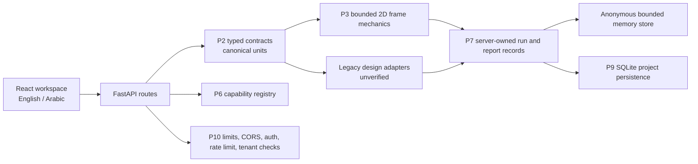

# Architecture

## Trust boundaries

The browser submits typed inputs and receives explicit status fields. It cannot register a trusted result or select a run hash. FastAPI validates and normalizes requests before invoking mechanics or legacy adapters. The P6 registry is the capability source of truth; the UI and reports snapshot it rather than recreating it.

Anonymous runs use the bounded process-local store and return `EPHEMERAL`. Project-owned runs require a bearer token and current organization membership, then persist the server-owned P7 record in the local database as `PROJECT_PERSISTED`. Project ownership metadata is outside the immutable P7 engineering hash. Reports regenerate PDF bytes from the stored record; PDF blobs are not durable storage.

P10 protection includes approved local CORS origins, a default 1 MiB request limit, model-complexity checks, a process-local rate limiter, strong auth-secret validation, no-store sensitive responses, and fail-closed project/run/report access. These are local controls, not a production security certification.

## Engineering separation

P3 response combinations contain bounded frame mechanics. Legacy design results, code-family combinations, and seismic handlers remain separate and unverified. `ENGINEERING_REVIEW_REQUIRED`, `LEGACY_UNVERIFIED`, `NOT_IMPLEMENTED`, and `SOURCE_BLOCKED` are not interchangeable. P4 and P5 have no verified module in this release candidate.

## Persistence and release boundary

The current topology is local development only: FastAPI, Vite, and SQLite. P12 must choose production hosting, database, blob/report strategy, secrets, TLS, backups, observability, migration, and rollback. No production topology is implied by this document.
