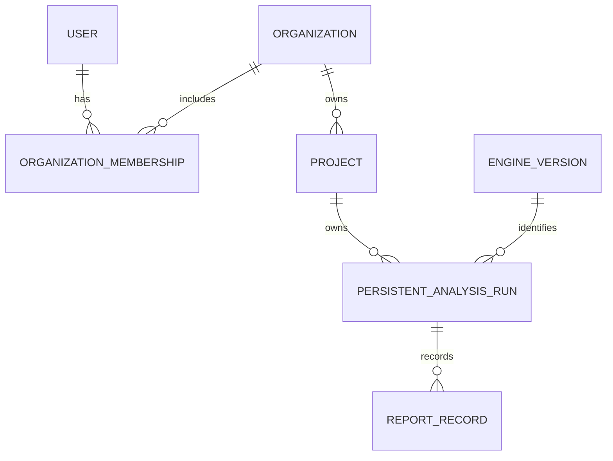

# Enterprise Data Foundation

P9 adds a local-first persistence and identity boundary. It does not change an engineering calculation, P6 capability status, or P7 engineering-record hash.

## Entities and ownership

- `User` stores a normalized unique email, a bcrypt password hash, activity state, and UTC audit timestamps.
- `Organization` is created with every local registration. Its creator receives an explicit `OWNER` membership; `MEMBER` is the only other P9 role.
- `Project` belongs to one organization and has create/update actor fields, UTC timestamps, and a lightweight version integer for optimistic updates.
- `PersistentAnalysisRun` belongs to a project and the executing user. It stores the exact P7 `AnalysisRunRecord` JSON plus its input, result, and record hashes.
- `EngineVersion` deduplicates the P7 engine metadata identity used by saved runs.
- `ReportRecord` records a successful project-owned report generation, its actor, schema version, time, and PDF content hash. PDF bytes are regenerated and are not stored.

Every project operation checks current database membership. JWT claims identify a user but never carry an authoritative organization role. Foreign project, run, and report identifiers return a non-disclosing 404.

## Run storage boundary

Anonymous v1 analysis remains supported. It creates a server-owned P7 run in the bounded process-local memory store and returns `EPHEMERAL`; its report is available until the local API restarts.

An analysis with `project_id` first requires a valid bearer token and current project membership, before calculation. A successful calculation writes the unchanged P7 record to the database and returns `PROJECT_PERSISTED`. Persistent run retrieval and report generation always authorize against the database, then parse and re-hash the saved P7 record. Integrity failure returns `RUN_INTEGRITY_ERROR` and prevents report generation.

Project ownership metadata stays outside the P7 record hash boundary. The browser cannot submit a result or choose record hashes; only a successful server calculation creates a persistent run.

## Entitlement boundary

`EntitlementProvider` is a deliberately small local allowance interface for project creation and run persistence. P9 has no billing, plans, payment fields, checkout, or invoice behavior.

## Security and deployment handoff

P9 is a local foundation only. It has no OAuth or SSO, MFA, password reset, email verification, invitations, durable PDF blob storage, production database hardening, cloud backup, or production deployment.

P10 must review CORS, request and rate limits, secret handling, dependency security, production authentication/session behavior, tenant-isolation regression gates, and CI. P12 must decide managed database topology, backups, migrations in production, report/blob storage, secret management, HTTPS, observability, and rollback before any release.
